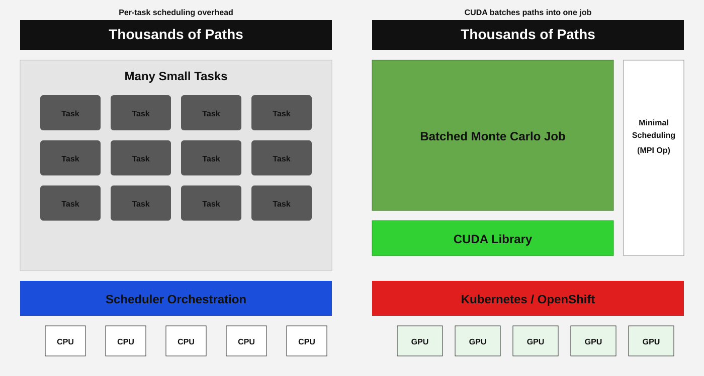

# MonteCarloCuda

Open-source reference stack for running Monte Carlo simulations on GPUs in Kubernetes.
It includes:

- A Python service API that accepts generic payloads + hyperparameters and launches worker jobs
- A CUDA-enabled worker container for embarrassingly parallel Monte Carlo runs (single GPU, multi-GPU, or multi-node)
- A callback test app that receives results and persists them to S3
- Kubernetes manifests and install scripts
- Operator install materials (GPU Operator, NCCL, NFD, MPI, SR-IOV)
- Terraform scaffolding for AWS EKS, S3, and GPU nodes

## Why CUDA for Monte Carlo

CPU-based Monte Carlo often fans out thousands of tiny tasks that need heavy scheduling.
CUDA batches those paths into a single GPU job, reducing per-task scheduling overhead for small tasks.

## Architecture

- `service` API accepts a job payload and launches worker Jobs or MPIJobs in Kubernetes.
- `worker` runs the simulation (CPU or CUDA), then posts results to the callback URL and exits.
- `callback` receives results and stores them in S3 or on disk.
- Operators (GPU, NCCL, MPI, NFD, SR-IOV) provide the runtime dependencies for GPU and MPI runs.

## Consumption modes

1) Single GPU / single node: run the worker container directly with `--gpus` for a simple local job.
2) SOA with leader worker nodes: use the service API to launch worker Jobs, or MPI multi-node runs
   where rank 0 acts as the leader and other ranks are worker nodes.

## Repo layout

- `service/` – API service container to accept jobs and launch workers
- `worker/` – CUDA Monte Carlo worker container
- `callback/` – test callback API + S3 sink
- `deploy/` – k8s manifests + deployment scripts
- `operators/` – operator install materials
- `docs/` – usage documentation
- `terraform/` – AWS EKS/S3/GPU node scaffolding
- `scripts/` – helper scripts (build/push)

## Examples

- `docs/USAGE.md` – end-to-end build, deploy, and job submission examples
- `deploy/templates/worker-job.yaml` – single worker Job example
- `deploy/templates/mpi-job.yaml` – multi-node MPIJob example
- `notebooks/api_evaluation.ipynb` – API smoke tests against service and callback

## Notebooks

- `notebooks/api_evaluation.ipynb` – Calls the service and callback APIs and performs basic checks.

## Quick start

See `docs/USAGE.md` for full instructions.
